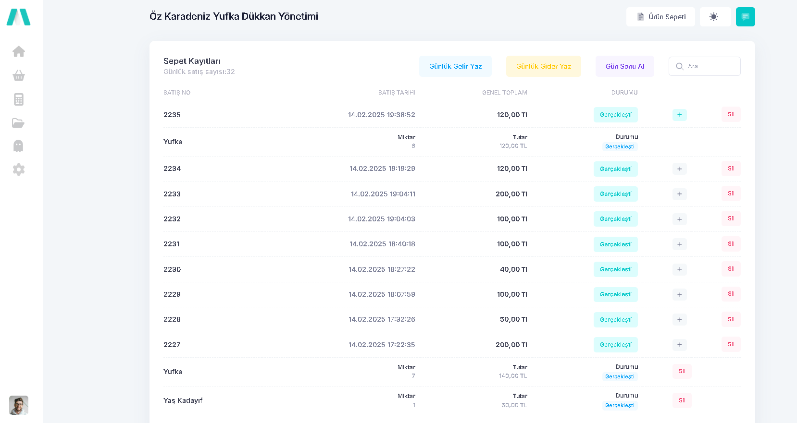
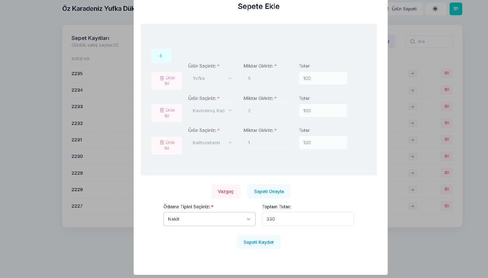
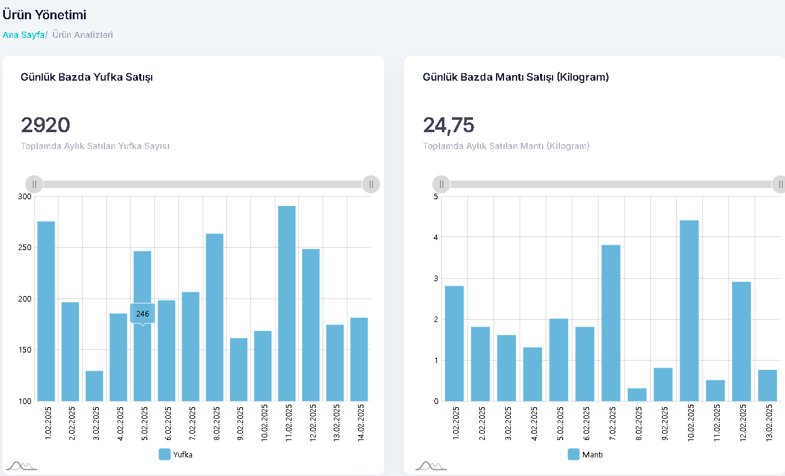
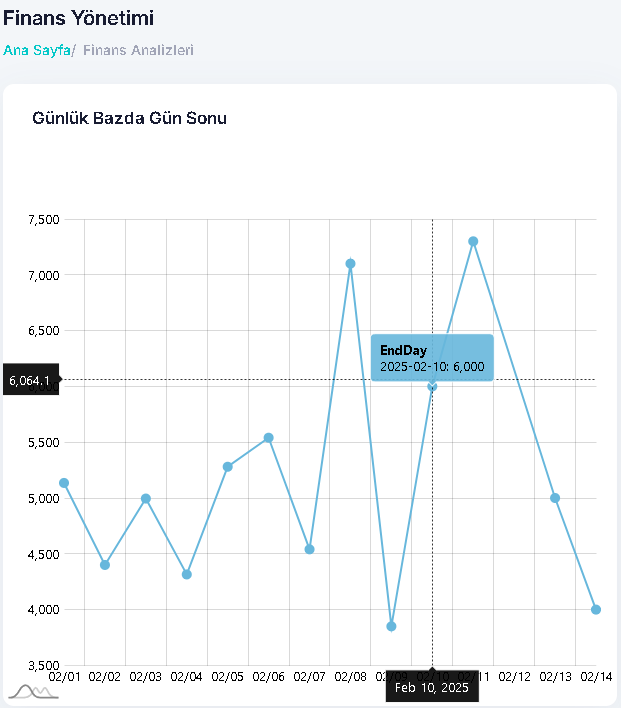

# 📌 Mini Dükkan Yönetimi

 **Bu proje, yerel işletmemizin yönetimi için oluşturulmuştur. Yapılan satışların takibi, ürün bazlı satış verilerinin değerlendirilmesi ve faaliyet raporlarının gözlemlenmesi gibi kolaylıkları sağlamıştır.**

---

## 🚀 Özellikler
✔️ Sepet Yönetimi ile satış verilerinin takibi
✔️ Doküman yönetimi ile Fatura ve Belge takibi
✔️ Grafikler

---

## 📥 Teknolojiler
- .NET 7.0 ile yazılmıştır.
- Veritabanı olarak SQL Server kullanıldı.

## 📷 Ekran Görüntüleri

